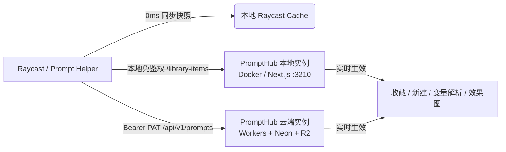

# Prompt Helper (Raycast Extension for PromptHub)

> **PromptHub** 的原生桌面伴侣插件 —— 呼之即来，即搜即填，0ms 瞬间直达，一键贴入任意应用。

---

## 🌟 核心特性

- **PromptHub 为唯一真源**：直接连接本地或远端 PromptHub 实例，无缝消费库内全量提示词（生图、文本、代码、视频、音频）。
- **0ms 秒开与轻量架构**：
  - 基于 Raycast 原生同步 `Cache` 实现快照瞬开，告别白屏菊花等待；
  - 智能 60s 新鲜度 TTL 与延迟 600ms 后台静默对齐，彻底杜绝唤起 Raycast 时的主线程争抢与掉帧；
  - 250ms 搜索输入防抖，高频键入丝滑顺畅。
- **智能综合流 (Smart Sections)**：
  - 默认无搜索时，按「🕒 最近使用」→「⭐ 我的收藏」→「全部提示词」三段分层，最高频词触手可及；
  - 支持持久化自定义默认视图（全部 / ⭐ 我的收藏 / 🕒 最近使用）；
  - 搜索时智能打平为全局结果流，支持毫秒级键盘精准定位。
- **与 PromptHub 深度双向联动**：
  - **收藏状态实时对齐**：使用 `Cmd + D` 快捷键即时星标收藏/取消，与 PromptHub 服务端双向实时同步；
  - **快速管理与维护**：支持在 Raycast 内一键新建（`Cmd + N`）或删除（`Ctrl + X`）提示词；
  - **效果图与缩略图内联预览**：直接解析 PromptHub 的 `/b/:sha` 资源，在 Detail 面板高保真渲染效果图；
  - **一键直达 Web 端**：支持通过 `Cmd + O` 一键在浏览器打开对应的 PromptHub `/p/:id/use` 交互面板。
- **智能占位符代入**：
  - 自动识别 PromptHub 原生 `[变量]` 与标准 `{{变量}}` 占位符；
  - 自动拉取 PromptHub 记录的**推荐默认参数值**并预填表单，回车即可生成最佳效果。
- **一键粘贴桌面工作流**：
  - 回车一键粘贴至当前最前台活跃窗口（Terminal、Cursor、VS Code、Slack、浏览器等）；
  - 支持快捷复制已渲染文本、复制原始模板代码。

---

## 🔗 与 PromptHub 的联动机制

Prompt Helper 深度遵循 PromptHub 的设计理念与 API 架构规范，支持灵活的双部署模式：



### 1. 本地单机模式 (Local-First)
* **默认地址**：`http://127.0.0.1:3210`
* **鉴权方式**：免 PAT 访问
* **运行机制**：自动访问本地 PromptHub `/library-items` 端点，享受真正 100% 离线、私有化的提示词管理，无需互联网连接。

### 2. 远端 / 云端多用户模式 (Remote / Cloud)
* **地址示例**：`https://hub.your-domain.com`
* **鉴权方式**：在 PromptHub 个人中心创建 **Personal Access Token (PAT)**，填入 Raycast 偏好设置中的 `apiKey`；
* **运行机制**：自动切换至标准的开放 REST API（`/api/v1/prompts`、`/api/v1/favorites`），支持多设备无缝同步与团队协作。

### 3. 数据与资产实时打通
* **效果图与缩略图**：视觉/生图类提示词通过 PromptHub 的 Blob 服务（`/b/:sha`）直接流式内联展示，无需重复下载或本地额外存储；
* **占位符联动**：读取 PromptHub 数据库中记录的 `placeholders` 列表及 `placeholder_defaults` 映射，填表时代入最佳参数。

---

## ⚙️ 配置说明 (Preferences)

呼出 Raycast，按 `Cmd + Shift + ,` 打开本扩展的偏好设置：

| 配置项 | 说明 | 默认值 | 适用场景 |
|---|---|---|---|
| **PromptHub Server URL** | PromptHub 服务端地址 | `http://127.0.0.1:3210` | 本地 Docker 部署保持默认；云端部署填入实际完整域名 |
| **Personal Access Token (PAT)** | 个人访问令牌（API Key） | 空 | 本地实例无需填写；连接远端/云端实例时必填 |
| **默认展示视图** | 打开插件时默认呈现的视图 | `全部提示词 (智能分段)` | 可选：`全部提示词 (智能分段)` / `⭐ 我的收藏` / `🕒 最近使用` |

> 💡 **提示**：除了在偏好设置中修改默认视图外，也可以直接在任意卡片的 Action 面板（`Cmd + K`）中找到「设置默认展示视图」进行一键快捷切换并永久生效。

---

## ⌨️ 常用快捷键

| 快捷键 | 功能动作 | 说明 |
|---|---|---|
| `Enter` | **填充变量并粘贴 / 直接粘贴** | 若包含变量则弹出参数填写抽屉，无变量直接粘贴入前台 App |
| `Cmd + Enter` | **直接粘贴** | 跳过参数填写直接粘贴原样模板 |
| `Cmd + N` | **新建提示词** | 呼出创建表单，录入标题、正文、分类、模型与标签 |
| `Cmd + D` | **切换收藏状态** | 收藏/取消收藏当前提示词，并与 PromptHub 实时同步 |
| `Ctrl + X` | **删除提示词** | 弹出二次确认弹窗，确认后从 PromptHub 数据库安全删除 |
| `Cmd + C` | **复制原始模板** | 复制原样文本至剪贴板，不触发占位符替换 |
| `Cmd + Shift + V` | **粘贴原始模板** | 粘贴原样文本至前台 App |
| `Cmd + O` | **在 PromptHub 中打开** | 调用默认浏览器打开提示词使用/编辑页（`/p/:id/use`） |
| `Cmd + R` | **重新拉取数据** | 强制刷新列表，同步最新的远端变更 |
| `Cmd + Shift + ,` | **打开插件偏好设置** | 快速进入 Raycast 设置调整 Server URL 或 PAT |

---

## 🛠️ 本地开发与贡献

本项目采用标准 TypeScript + React 构建，并通过 Vitest 进行高覆盖率单元测试：

```bash
# 1. 安装依赖
npm install

# 2. 运行单元测试 (27/27 单元全绿)
npm test

# 3. 静态代码分析与代码格式化
npm run lint
npm run fix-lint

# 4. 构建轻量生产包 (-e dist 优化)
npm run build

# 5. 打包为原生 .rayext 安装包
npx ray bundle
```

---

## 📄 开源许可

[MIT License](LICENSE) © 2026 sh0rk
